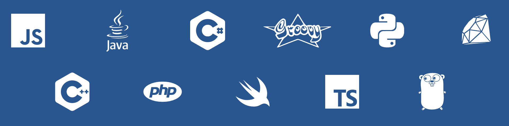
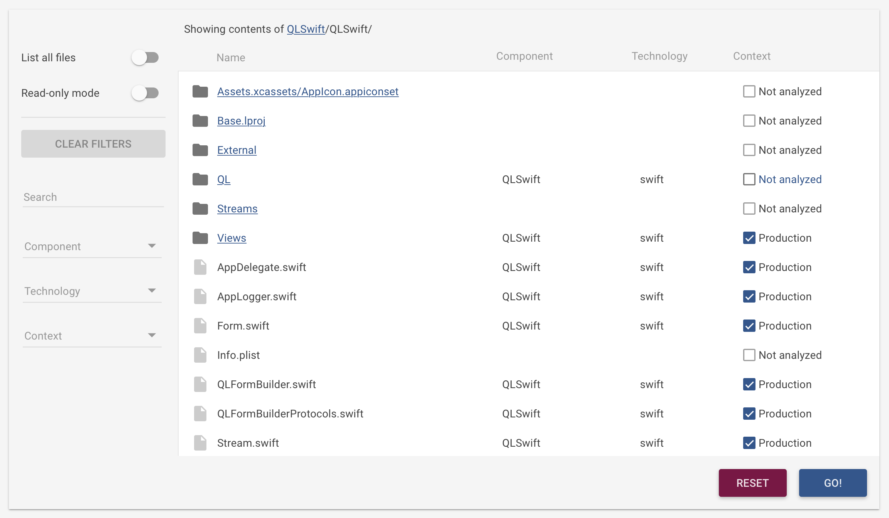

## UNDER CONSTRUCTION / Introduction

**What**: [Better Code Hub](https://bettercodehub.com) - a [GitHub Integration](https://github.com/integrations/better-code-hub) provided by [Software Improvement Group SIG](https://www.sig.eu).

**When**: 28 April - 19 May 2017 during the [Voxxed Days Athens](https://voxxeddays.com/athens/).

**Where**: [Village Cinemas @ the Mall Athens](http://www.villagecinemas.gr/el/kinimatografoi/the-mall-14-cinemas/).

### Welcome to our Voxxed Days Athens Contest. 
### How to join  

From 28 April to 19 May, you can work on your code base (a repository of your choice) while using Better Code Hub. In Athens - during Voxxed Days - we will announce the coders who where able to improve their code base best. 

**Winners will be awarded with Power Packs** - including a Better Code Hub license, Quality Software Development (QSD) exam voucher and hard copies of ‘Building Maintainable Software’ and ‘Building Software Teams - to really get you going on writing future-proof code. 

Find out how to get started with Better Code Hub and start improving your code right away! 

With Better Code Hub, you can check how good your team's code scores compared with the state of the art in software engineering. If Better Code Hub says you're compliant (✅) then it means you're performing like the top teams in the industry. It checks for compliance with 10 guidelines for Maintainable Software. 

The guidelines are described in full in the book [“Building Maintainable Software”](http://shop.oreilly.com/product/0636920049159.do) - be sure to get your complementary copy during the event! Compliance to the guidelines is derived from the Software Improvement Group's industry benchmark (8 billion lines of code, over 180 technologies). 

## Supported Languages

For a full list of the supported technologies, including Solidity, check [here](https://bettercodehub.com/docs/configuration-manual).

## If you're on GitHub you're good to go 

* **Public** repo? Just go to [bettercodehub.com](https://bettercodehub.com) and login [FREE] with your GitHub account.

* **Private**? Share your Github handle to get [PRO] access. Before the event: e-mail your name and personal GitHub handles to [bettercodehub@sig.eu](mailto:bettercodehub@sig.eu). During the event: go to the local Event staff with the handles.

## Zero set-up time

Using Better Code Hub is easy. Just head over to [bettercodehub.com](https://bettercodehub.com) and login with your GitHub account. You'll then see your repos, and you can start an analysis clicking the ▶️ button. 

If you want Better Code Hub to run for every Push and Pull Request on your repo, click the ⚙ icon and toggle the switch:

## Excluding files from analysis

Better Code Hub analyses all the code that is in your repository. This might include all the external libraries that you use. 

First do an initial analysis of your repository, so the "Analysis configuration" option becomes available. Then you can exclude these files by creating a **.bettercodehub.yml** configuration file located in the root of your repository. The code that goes into this file, can be generated with the "Analysis configuration" page which contains the following widget:

You can find this page by first clicking on the ⚙ icon and then clicking on "Analysis configuration". 

The resulting configuration file might look like:

~~~~
exclude:
- /mylibrary/src/.*
component_depth: 1
languages:
- java
- solidity
~~~~

Of course, you can create the configuration file directly, and place it to the root of your repository. For details check the [configuration manual](https://bettercodehub.com/docs/configuration-manual).

* **Solidity** in your repo? To analyze that languange too please add [- solidity] to the configuration file as shown in the example above. 

## Support and PRO License 

* If needed, get support through bettercodehub@sig.eu

## We'd like to hear from you
Don't hesitate to send us feedback at [bettercodehub@sig.eu](mailto://bettercodehub@sig.eu]). 

**Let's build some great software** 😊

Go, go, go! 

[Yiannis](https://github.com/ykanell), [Rob](https://github.com/robvanderleek), [Mircea](https://github.com/mcadariu) and [Michiel](https://github.com/michielcuijpers)

